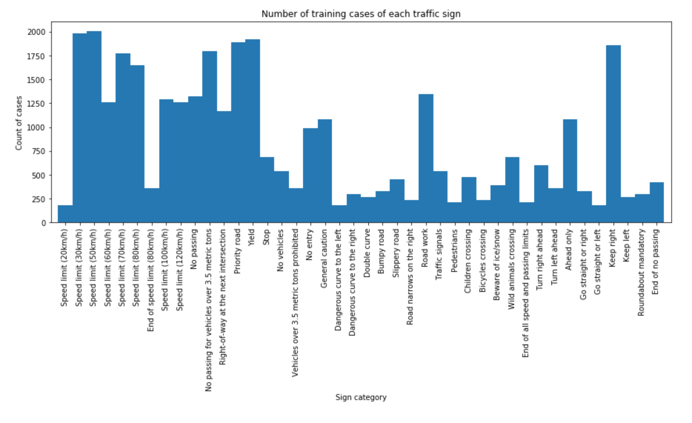
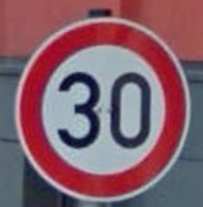
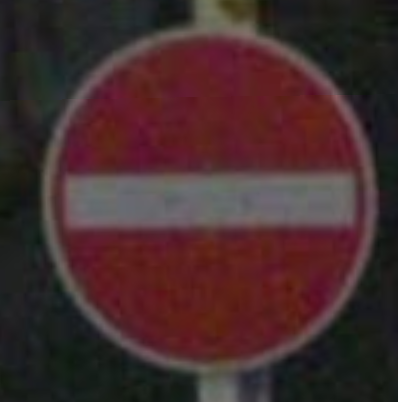
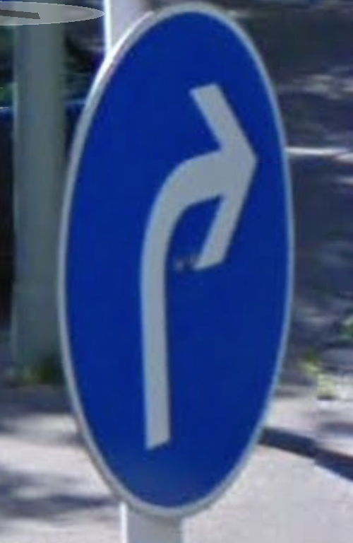
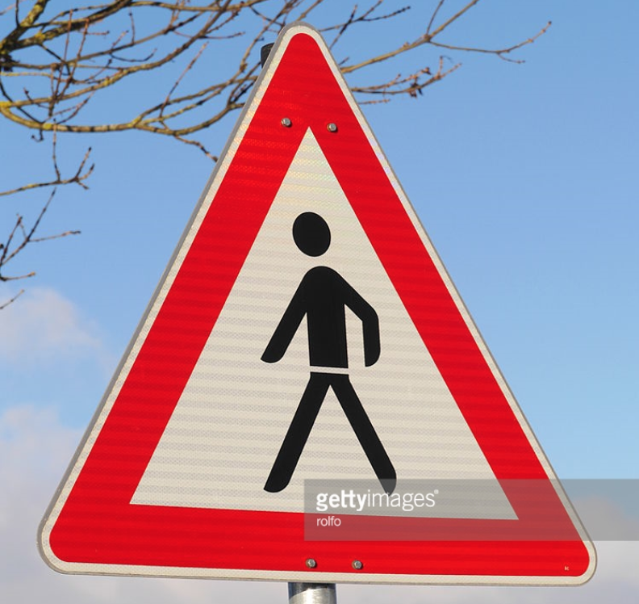
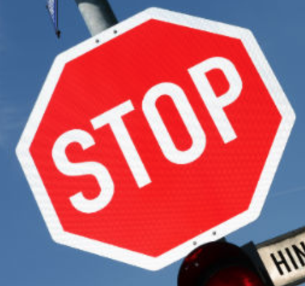
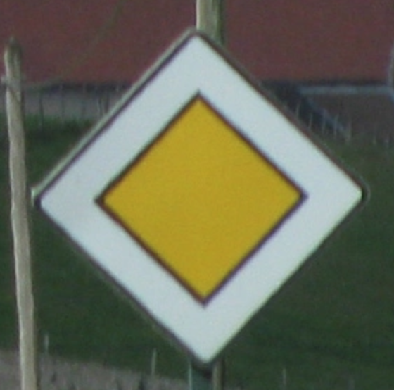
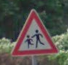

# **Traffic Sign Recognition** 

## Writeup

### You can use this file as a template for your writeup if you want to submit it as a markdown file, but feel free to use some other method and submit a pdf if you prefer.

---

**Build a Traffic Sign Recognition Project**

The goals / steps of this project are the following:
* Load the data set (see below for links to the project data set)
* Explore, summarize and visualize the data set
* Design, train and test a model architecture
* Use the model to make predictions on new images
* Analyze the softmax probabilities of the new images
* Summarize the results with a written report

[//]: # (Image References)

[image1]: ./examples/visualization.jpg "Visualization"
[image2]: ./examples/grayscale.jpg "Grayscaling"
[image3]: ./examples/random_noise.jpg "Random Noise"
[image4]: ./examples/placeholder.png "Traffic Sign 1"
[image5]: ./examples/placeholder.png "Traffic Sign 2"
[image6]: ./examples/placeholder.png "Traffic Sign 3"
[image7]: ./examples/placeholder.png "Traffic Sign 4"
[image8]: ./examples/placeholder.png "Traffic Sign 5"

## Rubric Points
### Here I will consider the [rubric points](https://review.udacity.com/#!/rubrics/481/view) individually and describe how I addressed each point in my implementation.  

---
### Writeup / README

#### 1. Provide a Writeup / README that includes all the rubric points and how you addressed each one. You can submit your writeup as markdown or pdf. You can use this template as a guide for writing the report. The submission includes the project code.

You're reading it! and here is a link to my [project code](https://github.com/udacity/CarND-Traffic-Sign-Classifier-Project/blob/master/Traffic_Sign_Classifier.ipynb)

### Data Set Summary & Exploration

#### 1. Provide a basic summary of the data set. In the code, the analysis should be done using python, numpy and/or pandas methods rather than hardcoding results manually.

I used the numpy library to calculate summary statistics of the traffic
signs data set:

* The size of training set is 34799
* The size of the validation set is 4410
* The size of test set is 12630
* The shape of a traffic sign image is (32, 32, 3)
* The number of unique classes/labels in the data set is 43

#### 2. Include an exploratory visualization of the dataset.

Here is an exploratory visualization of the data set. It is a bar chart showing how the data distributed among the 43 sign categories. The plot can be found in the notebook. "Speed limit 50 kph" has the most examples, and "Dangerous curve to the left" has the least.

### Design and Test a Model Architecture

#### 1. Describe how you preprocessed the image data. What techniques were chosen and why did you choose these techniques? Consider including images showing the output of each preprocessing technique. Pre-processing refers to techniques such as converting to grayscale, normalization, etc. (OPTIONAL: As described in the "Stand Out Suggestions" part of the rubric, if you generated additional data for training, describe why you decided to generate additional data, how you generated the data, and provide example images of the additional data. Then describe the characteristics of the augmented training set like number of images in the set, number of images for each class, etc.)

I did two things in data preprocessing. 

First is to correct the brightness of the images, as I noticed some of the images are very dark. I applied color histogram equalization to adjust the brightness. 

Secondly I applied normalisation on the inputs to scale them to 0 mean and equal variance. This is for the optimizer to work better and faster.

I didn't change the images to grayscale as I believe color is an important feature in traffic sign classification. Although the model trains faster with grayscale images (only 1 color channel), I should not compromise the model accuracy for that.

It would be good if I created additional images using augmentation techniques (rotation, adding noise, scaling, lightening), if I had time.

#### 2. Describe what your final model architecture looks like including model type, layers, layer sizes, connectivity, etc.) Consider including a diagram and/or table describing the final model.

My final model consisted of the following layers, the final model used to get the reported test accuracy doesn't include the dropout layers:

| Layer         		|     Description	        					| 
|:---------------------:|:---------------------------------------------:| 
| Input         		| 32x32x3 RGB image   							| 
| Convolution 5x5     	| 1x1 stride, valid padding, outputs 28x28x16 	|
| RELU					|												|
| Dropout   | keep prob 0.8 |
| Max pooling	    	| 2x2 stride,  outputs 14x14x16 				|
| Convolution 5x5	    | 1x1 stride, valid padding, outputs 10x10x32      									|
| RELU					|												|
| Dropout   | keep prob 0.8 |
| Max pooling	      	| 2x2 stride,  outputs 5x5x32 				|
| Fully connected		| 512 outputs        									|
| RELU				|        									|
| Dropout   | keep prob 0.5 |
|	Fully connected				|	128 outputs											|
|	RELU					|												|
| Dropout   | keep prob 0.5 |
|	Fully connected (logits)				|	43 outputs											|
 

#### 3. Describe how you trained your model. The discussion can include the type of optimizer, the batch size, number of epochs and any hyperparameters such as learning rate.

To train the model, I used a LeNet with one-hot encoding. Batch size 128, 50 epoches, learning rate 0.001. I used Adam optimizer because it uses moving averages of the parameters (momentum) so that it performs faster than Grandient Descent Optimizer. Down side is that it requires more computation for each training step.

#### 4. Describe the approach taken for finding a solution and getting the validation set accuracy to be at least 0.93. Include in the discussion the results on the training, validation and test sets and where in the code these were calculated. Your approach may have been an iterative process, in which case, outline the steps you took to get to the final solution and why you chose those steps. Perhaps your solution involved an already well known implementation or architecture. In this case, discuss why you think the architecture is suitable for the current problem.

My final model results were:
* training set accuracy of >0.99
* validation set accuracy of 0.96 
* test set accuracy of 0.95

If a well known architecture was chosen:
* I chose the LeNet, with additional regularization (dropout).
* I believe it's relevant to the traffic sign application because the paper and the other well-built models prove it works well on images classification.
* The final validation accuracy of 96% and the test accuracy of 95% proved that the model works well on classifying traffic signs, and this is without regularization and much parameter finetuning. I believe if I had added addtional input images, applied regularization, tuned the parameters and kept the model training for longer, I should have even better results.
 

### Test a Model on New Images

#### 1. Choose five German traffic signs found on the web and provide them in the report. For each image, discuss what quality or qualities might be difficult to classify.

Here are seven German traffic signs that I found on the web:

  
  
 

The third image might be difficult to classify because it's not facing forwards.

#### 2. Discuss the model's predictions on these new traffic signs and compare the results to predicting on the test set. At a minimum, discuss what the predictions were, the accuracy on these new predictions, and compare the accuracy to the accuracy on the test set (OPTIONAL: Discuss the results in more detail as described in the "Stand Out Suggestions" part of the rubric).

Here are the results of the prediction:

| Image			        |     Prediction	        					| 
|:---------------------:|:---------------------------------------------:| 
| Stop Sign      		| Stop sign   									| 
| Speed limit (30km/h)     			| Speed limit (30km/h) 										|
| Priority road					| Priority road											|
| Pedestrians      		| 			Right-of-way at the next intersection		 				|
| No Entry			| No Entry     							|
| Children crossing  | Children crossing |
|Turn right ahead | Turn right ahead |

The model was able to correctly guess 6 of the 7traffic signs, which gives an accuracy of 85.7%. this is much lower than the validation and test accuracy using the provided dataset. The source and quality seems to impact the performance of the model a lot. 

#### 3. Describe how certain the model is when predicting on each of the five new images by looking at the softmax probabilities for each prediction. Provide the top 5 softmax probabilities for each image along with the sign type of each probability. (OPTIONAL: as described in the "Stand Out Suggestions" part of the rubric, visualizations can also be provided such as bar charts)

For the first image the model is very confident that this is a Priority road (probability of 1.), and the image does contain a Priority road. The top five soft max probabilities were

| Probability         	|     Prediction	        					| 
|:---------------------:|:---------------------------------------------:| 
| 1.         			| Priority road  									| 
| .0     				| Yield										|
| .0					| Stop										|
| .0	      			| End of speed limit (80km/h)			 				|
| .0				    | End of all speed and passing limits    							|

For the second image the model is very confident that this is a No Entry (probability of 1.), and the image does contain a No Entry. The top five soft max probabilities were

| Probability         	|     Prediction	        					| 
|:---------------------:|:---------------------------------------------:| 
| 1.         			| No Entry									| 
| .0     				| Speed limit (30km/h)										|
| .0					| Stop										|
| .0	      			| Speed limit (20km/h)	 				|
| .0				    | Beware of ice/snow    							|

For the third image the model is very confident that this is a Stop Sign (probability of .998), and the image does contain a Stop Sign. The top five soft max probabilities were

| Probability         	|     Prediction	        					| 
|:---------------------:|:---------------------------------------------:| 
| .998         			| Stop Sign								| 
| .0     				| Yield									|
| .0					| Speed limit (80km/h)										|
| .0	      			| Road work 				|
| .0				    | Dangerous curve to the right   							|

For the fourth image, the model is very confident that this is a Turn right ahead (probability of .999), and the image does contain a Turn right ahead. The top five soft max probabilities were

| Probability         	|     Prediction	        					| 
|:---------------------:|:---------------------------------------------:| 
| 0.999         			| Turn right ahead  									| 
| .0     				| Right-of-way at the next intersection										|
| .0					| Roundabout mandatory										|
| .0	      			| Yield			 				|
| .0				    | Ahead only    							|

For the fifth image, the model is very confident that this is a Speed limit (30km/h) (probability of 1.), and the image does contain a Speed limit (30km/h). The top five soft max probabilities were

| Probability         	|     Prediction	        					| 
|:---------------------:|:---------------------------------------------:| 
| 1.         			| Speed limit (30km/h)   									| 
| .0     				| End of speed limit (80km/h)										|
| .0					| Speed limit (20km/h)											|
| .0	      			| Speed limit (80km/h)			 				|
| .0				    | Speed limit (50km/h)    							|

For the sixth image, the model is very confident that this is a Children crossing (probability of 1.), and the image does contain a Children crossing. The top five soft max probabilities were

| Probability         	|     Prediction	        					| 
|:---------------------:|:---------------------------------------------:| 
| 1.         			| Children crossing  									| 
| .0     				| Dangerous curve to the right										|
| .0					| Go straight or right											|
| .0	      			| Road narrows on the right		 				|
| .0				    | Bicycles crossing    							|

For the seventh image, the model is very confident that this is a Right-of-way at the next intersection (probability of 0.87), and the image does contain a Pedestrians. The top five soft max probabilities were

| Probability         	|     Prediction	        					| 
|:---------------------:|:---------------------------------------------:| 
| 0.87         			| Right-of-way at the next intersection 									| 
| .125     				| General caution										|
| .0					| Road work										|
| .0	      			| Pedestrians	 				|
| .0				    | Dangerous curve to the right  							|

I think that the model got 'Pedestrians' sign wrong because this sign has very low amount in the training dataset hence the model has learned it well, especially given the complex of the features of this sign.

